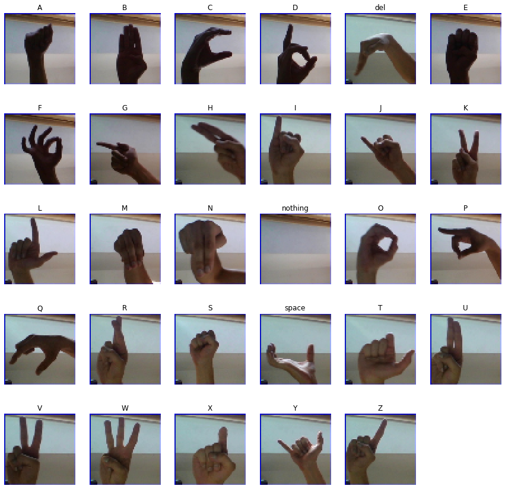

# ASL Image Classifier

ASL Image Classifier can differentiate between 29 classes namely

- 26 Alphabets
- 'space', 'delete' and 'nothing'

Dataset : https://www.kaggle.com/grassknoted/asl-alphabet
